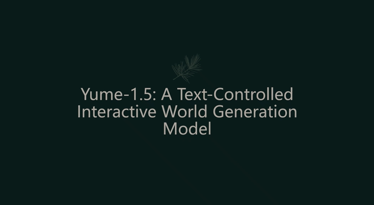

<div align="center">

</div>

## 🔥🔥🔥 News!!
* Dec 26, 2025: 🔥 We have released the [Yume-5B model](https://huggingface.co/stdstu123/Yume-5B-720P). Additionally, we have released the [Yume-1.5 paper](https://arxiv.org/pdf/2512.22096), which introduces a new interactive world foundation model.
* July 23, 2025: 🔥 We released Yume-1.0. The first **fully open-source real-world** world model (including data, training/inference code, and weights).


# Yume: An Interactive World Generation Model

Yume is a long-term project that aims to create an interactive, realistic, and dynamic world through the input of text, images, or videos.


<div align="center">


[](https://stdstu12.github.io/YUME-Project/)&nbsp;
[](https://arxiv.org/abs/2507.17744)&nbsp;
[](https://huggingface.co/stdstu123/Yume-I2V-540P)&nbsp;
[](https://huggingface.co/stdstu123/Yume-5B-720P)&nbsp;
[](https://www.youtube.com/watch?v=51VII_iJ1EM)&nbsp;

</div>

- A distillation recipes for video DiT based on [OSV](https://openaccess.thecvf.com/content/CVPR2025/papers/Mao_OSV_One_Step_is_Enough_for_High-Quality_Image_to_Video_CVPR_2025_paper.pdf).
- [FramePack-Like](https://github.com/lllyasviel/FramePack) training code.
- Long video generation method with DDP/FSDP sampling support
- Dataset processing code that converts real-world camera trajectories into discrete keyboard controls.


## 🔧 Installation
The code is tested on Python 3.10.0, CUDA 12.1 and A100.
```
./env_setup.sh fastvideo
pip install -r requirements.txt
```
You need to run `pip install .` after each code modification, or alternatively, you can copy the modified files directly into your virtual environment. For example, if I modified `wan/image2video.py` and my virtual environment is `yume`, I can copy the file to:
`envs/yume/lib/python3.10/site-packages/wan/image2video.py`.

## 📦 Windows One-Click Install & Run 
To facilitate the use and testing of Yume-5B, we provide a one-click solution for Windows to launch the Web Demo. Simply run `run_oneclick_debug.bat` and open the displayed URL in your browser.

This program has been successfully tested on an RTX 4090 Laptop GPU (16GB). We recommend using a GPU with at least 16GB VRAM. Please adjust the sampling steps between 4 and 50 based on your GPU performance. Note that higher steps yield better quality but will result in slower generation speeds.

## 📹 Demo
[](demo/demo.mp4)


## 🚀 Inference

### ODE
For image-to-video generation, we use `--jpg_dir="./jpg"` to specify the input image directory and `--caption_path="./caption.txt"` to provide text conditioning inputs, where each line corresponds to a generation instance controlling 2-second video output.
```bash
# Download the model weights and place them in Path_To_Yume.
bash scripts/inference/sample_jpg.sh 
```
We also consider generating videos using the data from `./val`, where `--test_data_dir="./val"` specifies the location of the example data.
```bash
# Download the model weights and place them in Path_To_Yume.
bash scripts/inference/sample.sh 
```
### SDE
We perform TTS sampling, where `args.sde` controls whether to use SDE-based sampling.
```bash
# Download the model weights and place them in Path_To_Yume.
bash scripts/inference/sample_tts.sh 
```

For optimal results, we recommend keeping Actual distance, Angular change rate (turn speed), and View rotation speed within the range of 0.1 to 10. 

Key adjustment guidelines:
1. When executing Camera remains still (·), reduce the Actual distance value
2. When executing Person stands still, decrease both Angular change rate and View rotation speed values

Note that these parameters (Actual distance, Angular change rate, and View rotation speed) do impact generation results. As an alternative approach, you may consider removing these parameters entirely for simplified operation.

### 5B
We perform sampling using the 5B model. First, download the weights from Hugging Face and place them in the current directory under `./Yume-5B-720p`. `args.T2V` controls whether the model operates in text-to-video mode, and `args.prompt` specifies the input caption.
```bash
# Download the model weights and place them in Path_To_Yume.
bash scripts/inference/sample_tts.sh 
```

## 🎯 Training & Distill 
For model training, we use `args.MVDT` to launch the MVDT framework, which requires at least 16 A100 GPUs. Loading T5 onto the CPU may help conserve GPU memory. We employ `args.Distil` to enable adversarial distillation.
```bash
# Download the model weights and place them in Path_To_Yume.
bash scripts/finetune/finetune.sh
```

## 🧱 Dataset Preparation
`decode_camera_controls_from_c2w_sequence.py` converts camera trajectories into keyboard directional controls. Please refer to https://github.com/Lixsp11/sekai-codebase to download the dataset. For the processed data format, refer to `./test_video`.
```
path_to_processed_dataset_folder/
├── Keys_None_Mouse_Down/ 
│   ├── video_id.mp4
│   ├── video_id.txt
├── Keys_None_Mouse_Up
│──  ...
└── Keys_S_Mouse_·
```
The provided TXT file content record either camera motion control parameters or animation keyframe data, with the following field definitions:
```
Start Frame: 2 #Starting frame number (begins at frame 2 at origin video)

End Frame: 50 #Ending frame number

Duration: 49 frames #Total duration

Keys: W #Keyboard input

Mouse: ↓ #Mouse action
```
In `scripts/finetune/finetune.sh`, `args.root_dir` represents the `path_to_processed_dataset_folder`, and `args.root_dir` represents the full path to the Sekai dataset.


## 📑 Development Plan
- Dataset processing
  - [ ] Providing processed datasets
  - [√] Provide dataset processing functions
- Code update
  - [ ] fp8 support
  - [ ] Better distillation methods
- ​​Model Update
  - [√] Quantized and Distilled Models
  - [√] Models for 720p Resolution Generation​

## 🤝 Contributing
We welcome all contributions.


## Acknowledgement
We learned and reused code from the following projects:
- [FastVideo](https://github.com/hao-ai-lab/FastVideo)
- [diffusers](https://github.com/huggingface/diffusers)
- [HunyuanVideo-I2V](https://github.com/Tencent-Hunyuan/HunyuanVideo-I2V)
- [Wan2.1](https://github.com/Wan-Video/Wan2.1)
- [Skywork-Reward-V2](https://github.com/SkyworkAI/Skywork-Reward-V2)
- [MDT](https://github.com/sail-sg/MDT)
- [AddSR](https://github.com/NJU-PCALab/AddSR)

## Citation
If you use Yume for your research, please cite our paper:

```bibtex
@article{mao2025yume,
  title={Yume: An Interactive World Generation Model},
  author={Mao, Xiaofeng and Lin, Shaoheng and Li, Zhen and Li, Chuanhao and Peng, Wenshuo and He, Tong and Pang, Jiangmiao and Chi, Mingmin and Qiao, Yu and Zhang, Kaipeng},
  journal={arXiv preprint arXiv:2507.17744},
  year={2025}
}
@article{mao2025yume,
  title={Yume-1.5: A Text-Controlled Interactive World Generation Model},
  author={Mao, Xiaofeng and Li, Zhen and Li, Chuanhao and Xu, Xiaojie and Ying, Kaining and He, Tong and Pang, Jiangmiao and Qiao, Yu and Zhang, Kaipeng},
  journal={arXiv preprint arXiv:2512.22096},
  year={2025}
}

```
